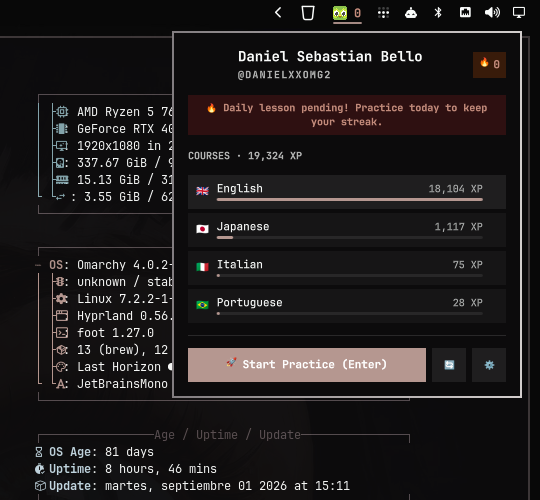

# Duolingo Plugin for Omarchy 🦉🔥

[](LICENSE)
[](https://omarchy.org)
[](https://quickshell.outfoxxed.me)
<p align="center">
  
</p>

> Track your Duolingo streak in real-time on your status bar, monitor multilingual course progress, and get evening reminder notifications when your daily habit is at risk.

---

## ⚡ Quick Start

### 1. Install Plugin
```bash
omarchy plugin add https://github.com/danielxxomg/omarchy-duolingo --enable
```

### 2. Add Hotkey (`~/.config/hypr/bindings.lua`)
```lua
o.bind("SUPER + CTRL + D", "Duolingo Tracker", "omarchy-shell user.duolingo toggle")
```

### 3. Verify in Terminal
```bash
omarchy-shell user.duolingo status
```

---

## 🎯 What It Does

| Component | Behavior |
| :--- | :--- |
| **Bar Pill (`BarWidget.qml`)** | Shows flame and streak (`🔥 45`). Colors **Accent Green** when done today, **Urgent Amber** when pending. |
| **Popup Panel (`Panel.qml`)** | Full course breakdown with flags (🇬🇧, 🇯🇵, 🇮🇹, 🇧🇷), XP bars, and one-click practice launch. |
| **Background Daemon (`Service.qml`)** | Fires desktop notification at 20:00 if your lesson is still pending. |
| **Zero-Config (`bin/detect-user.py`)** | Reads your local Duolingo desktop or browser session to resolve your username with 0 manual steps. |
| **Universal Launcher (`bin/launch-duo.sh`)** | Launches native AUR binary, Flatpak DL-Desktop, Omarchy WebApp, or default browser fallback. |

---

## ⌨️ Controls & Shortcuts

| Context | Action | Key / Gesture |
| :--- | :--- | :--- |
| **Status Bar** | Open/close popup panel | `Left Click` |
| **Status Bar** | Launch Duolingo app directly | `Right Click` |
| **Status Bar** | Force refresh stats | `Middle Click` |
| **Popup Panel** | Navigate between courses | `j` / `k` or `Arrow Keys` |
| **Popup Panel** | Start practicing active course | `Enter` |
| **Popup Panel** | Refresh stats from API | `r` |
| **Popup Panel** | Open settings drawer | `s` |
| **Popup Panel** | Close popup | `Esc` or `q` |

---

## 🌐 Supported Linux Duolingo Ecosystem

This plugin is designed as the status bar companion for all Duolingo tools available on Linux:

| Tool | Role | Installation | Compatibility |
| :--- | :--- | :--- | :--- |
| **[DL-Desktop](https://github.com/hmlendea/dl-desktop)** | Dedicated Electron App | AUR: `yay -S duolingo-desktop-bin`<br>Flatpak: `flatpak install flathub com.github.hmlendea.DL-Desktop` | Full auto-detection & direct launch |
| **Omarchy WebApp** | Native Wayland PWA | `omarchy webapp install "Duolingo" "https://www.duolingo.com"` | Full hardware acceleration & direct launch |
| **[AnkiSyncDuolingo](https://github.com/AnkiSyncDuolingo)** | SRS Vocabulary Sync | GitHub / AnkiWeb Add-on | Recommended companion for long-term memory |

---

## ⚙️ Configuration (`~/.config/omarchy/shell.json`)

Configure directly via the popup settings drawer (`s`) or in `~/.config/omarchy/shell.json`:

```json
{
  "bar": {
    "layout": {
      "right": [
        {
          "id": "user.duolingo",
          "username": "",
          "refreshMinutes": 15,
          "showXp": false,
          "remindersEnabled": true,
          "remindHour": 20
        }
      ]
    }
  }
}
```

| Key | Type | Default | Description |
| :--- | :--- | :--- | :--- |
| `username` | string | `""` | Duolingo username. When empty, automatically extracts from local desktop session. |
| `refreshMinutes` | integer | `15` | Polling interval in minutes. Cached state loads instantly on cold boot. |
| `showXp` | boolean | `false` | When true, renders Total XP on the bar instead of the streak count. |
| `remindersEnabled` | boolean | `true` | Enables evening reminder notifications when streak is unfulfilled. |
| `remindHour` | integer | `20` | Hour of day (0-23) to trigger the streak reminder. |

---

## 🧪 IPC Reference

Integrate with custom scripts, Waybar, or polybar:

```bash
omarchy-shell user.duolingo toggle   # Toggle popup panel
omarchy-shell user.duolingo launch   # Launch preferred Duolingo client
omarchy-shell user.duolingo refresh  # Refresh stats from API
omarchy-shell user.duolingo status   # Output single-line text summary
```

---

## 🗑️ Removal

```bash
omarchy plugin remove user.duolingo
```

---

## 📄 License

MIT License © 2026 danielxxomg.
