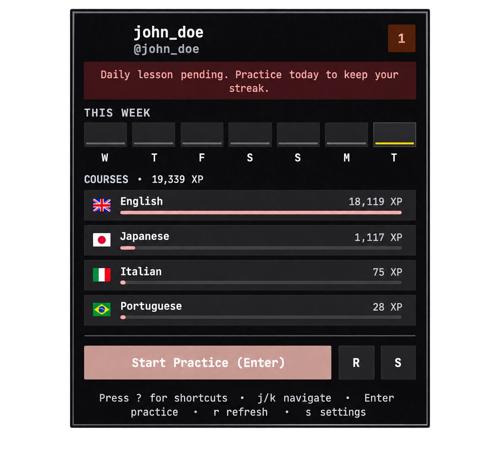
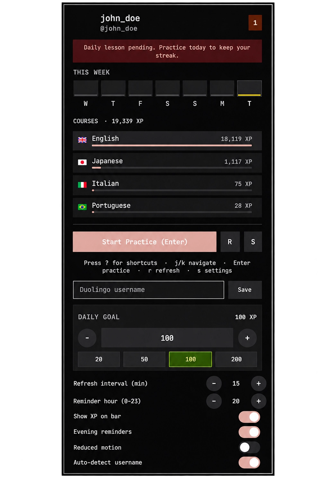

# Duolingo Plugin for Omarchy

[](LICENSE)
[](https://omarchy.org)
[](https://quickshell.outfoxxed.me)
<p align="center">
  
</p>

> Track your Duolingo streak in real-time on your status bar, monitor multilingual course progress, and get evening reminder notifications when your daily habit is at risk.

## Screenshots

| Overlay command palette | Popup panel | Settings |
| :---: | :---: | :---: |
|  |  |  |

---

## Quick Start

### 1. Install Plugin
```bash
omarchy plugin add https://github.com/danielxxomg/omarchy-duolingo --enable
```

### 2. Add Hotkey (`~/.config/hypr/bindings.lua`)
```lua
o.bind("SUPER + CTRL + D", "Duolingo Tracker", "omarchy-shell user.duolingo toggle")
```

### 3. Verify in Terminal
```bash
omarchy-shell user.duolingo status
```

---

## What It Does

| Component | Behavior |
| :--- | :--- |
| **Bar Pill (`BarWidget.qml`)** | Shows the streak number (e.g. `45`). Accent green when today is done, amber when pending. Tooltip includes daily goal progress. |
| **Popup Panel (`Panel.qml`)** | Today goal bar (XP today vs goal), 7-day week strip, full course breakdown with language flags and XP bars, and one-click practice launch. Settings face covers all options; `?` reveals keyboard shortcuts. |
| **Background Daemon (`Service.qml`)** | Persists daily snapshots to `~/.local/state/duolingo/history.json`, fires desktop notification at the configured hour if your lesson is still pending. |
| **Overlay (`Overlay.qml`)** | Full-screen command palette: large streak arc with goal progress, week strip, command line with ghost completion, and panes for today, history, and help. Handles verb grammar via `Commands.js`. |
| **Zero-Config (`bin/detect-user.py`)** | Reads your local Duolingo desktop or browser session to resolve your username with 0 manual steps. |
| **Universal Launcher (`bin/launch-duo.sh`)** | Launches native AUR binary, Flatpak DL-Desktop, Omarchy WebApp, or default browser fallback. |

---

## Controls & Shortcuts

| Context | Action | Key / Gesture |
| :--- | :--- | :--- |
| **Status Bar** | Open/close popup panel | `Left Click` |
| **Status Bar** | Launch Duolingo app directly | `Right Click` |
| **Status Bar** | Force refresh stats | `Middle Click` |
| **Popup Panel** | Navigate between courses | `j` / `k` or `Arrow Keys` |
| **Popup Panel** | Start practicing active course | `Enter` |
| **Popup Panel** | Refresh stats from API | `r` |
| **Popup Panel** | Open settings drawer | `s` |
| **Popup Panel** | Toggle shortcuts help | `?` |
| **Popup Panel** | Close popup | `Esc` or `q` |
| **Overlay** | Open overlay | `omarchy-shell user.duolingo overlay` or `SUPER + CTRL + G` (optional keybinding) |
| **Overlay** | Submit command | `Enter` |
| **Overlay** | Accept ghost completion | `Tab` |
| **Overlay** | Cycle suggestions | `Up` / `Down` |
| **Overlay** | Switch panes (today/history/help) | `PgUp` / `PgDn` |
| **Overlay** | Clear input, then close | `Esc` |

---

## Supported Linux Duolingo Ecosystem

This plugin is designed as the status bar companion for all Duolingo tools available on Linux:

| Tool | Role | Installation | Compatibility |
| :--- | :--- | :--- | :--- |
| **[DL-Desktop](https://github.com/hmlendea/dl-desktop)** | Dedicated Electron App | AUR: `yay -S duolingo-desktop-bin`<br>Flatpak: `flatpak install flathub com.github.hmlendea.DL-Desktop` | Full auto-detection & direct launch |
| **Omarchy WebApp** | Native Wayland PWA | `omarchy webapp install "Duolingo" "https://www.duolingo.com"` | Full hardware acceleration & direct launch |
| **[AnkiSyncDuolingo](https://github.com/AnkiSyncDuolingo)** | SRS Vocabulary Sync | GitHub / AnkiWeb Add-on | Recommended companion for long-term memory |

---

## Configuration (`~/.config/omarchy/shell.json`)

Configure directly via the popup settings drawer (`s`) or in `~/.config/omarchy/shell.json`:

```json
{
  "bar": {
    "layout": {
      "right": [
        {
          "id": "user.duolingo",
          "username": "",
          "autoDetect": false,
          "refreshMinutes": 15,
          "showXp": false,
          "remindersEnabled": true,
          "remindHour": 20,
          "goalXp": 50,
          "reducedMotion": false
        }
      ]
    }
  }
}
```

| Key | Type | Default | Description |
| :--- | :--- | :--- | :--- |
| `username` | string | `""` | Duolingo username (recommended). Leave empty only together with `autoDetect: true`. |
| `autoDetect` | boolean | `false` | Opt-in local username scan, OFF by default. When true and `username` is empty, reads only the LevelDB Local Storage folders listed in the Privacy section and extracts only the `user.username` field. |
| `refreshMinutes` | integer | `15` | Polling interval in minutes. Cached state loads instantly on cold boot. |
| `showXp` | boolean | `false` | When true, renders Total XP on the bar instead of the streak count. |
| `remindersEnabled` | boolean | `true` | Enables evening reminder notifications when streak is unfulfilled. |
| `remindHour` | integer | `20` | Hour of day (0-23) to trigger the streak reminder. |
| `goalXp` | integer | `50` | Daily XP goal. Progress shown in panel and bar tooltip (`23 / 50 XP today`). |
| `reducedMotion` | boolean | `false` | When true, disables panel animations for reduced motion. |

---

## Overlay

Full-screen command palette reached via IPC or an optional keybinding. Right click on the bar keeps launching Duolingo; overlay is accessed separately so existing muscle memory is preserved.

```bash
omarchy-shell user.duolingo overlay              # Open the overlay
omarchy-shell user.duolingo run "help"           # Execute a command without opening the overlay
omarchy-shell user.duolingo run "goal 100"       # Set daily goal to 100 XP
omarchy-shell user.duolingo run "username duo_learner"  # Set username
```

Optional keybinding in `~/.config/hypr/bindings.lua` (commented suggestion in `install.sh`):

```lua
-- o.bind("SUPER + CTRL + G", "Duolingo Overlay", "omarchy-shell user.duolingo overlay")
-- or: o.bind("SUPER + CTRL + G", "Duolingo Help", "omarchy-shell user.duolingo run help")
```

The overlay shows a large streak and goal arc (ignition sweep on open, disabled when `reducedMotion` is true), a week strip derived from `history.json`, and a command line on the right. Panes: `today` (goal + streak + courses), `history` (recent days from history), `help` (all verbs).

| Command | Aliases | Example | Description |
| :--- | :--- | :--- | :--- |
| `practice` | `p`, `learn`, `go` | `practice` | Launch Duolingo |
| `refresh` | `r`, `reload`, `sync` | `refresh` | Refresh stats from API |
| `open` | `panel` | `open` | Close overlay (and reveal panel) |
| `username <name>` | `user`, `name`, `u` | `username duo_learner` | Set Duolingo username (2-25 chars, `^[A-Za-z0-9_.-]+$`) |
| `goal <n>` | `target` | `goal 100` or `100` | Set daily XP goal 10-1000 (bare number also sets goal) |
| `streak` |  | `streak` | Show current streak |
| `xp` |  | `xp` | Show total XP |
| `today` | `t`, `now` | `today` | Show today's XP progress |
| `history` | `h`, `log` | `history` | Switch to history pane |
| `help` | `?` | `help` | Switch to help pane |
| `quit` | `q`, `close`, `exit` | `quit` | Close the overlay |

Ghost completion shows the remainder of the top suggestion; `Tab` accepts it. Arrow keys cycle suggestions. `PgUp`/`PgDn` cycles panes. `Esc` clears the input first, then closes.

---

## IPC Reference

Integrate with custom scripts, Waybar, or polybar:

```bash
omarchy-shell user.duolingo toggle            # Toggle popup panel
omarchy-shell user.duolingo launch            # Launch preferred Duolingo client
omarchy-shell user.duolingo refresh           # Refresh stats from API
omarchy-shell user.duolingo status            # Output single-line text summary
omarchy-shell user.duolingo streak            # Output streak count
omarchy-shell user.duolingo overlay           # Open full-screen overlay
omarchy-shell user.duolingo run "<command>"   # Run any overlay command (see table above)
```

| Version | Manifest kinds | Entry points |
| :--- | :--- | :--- |
| 1.2.0 | `bar-widget`, `service` | `barWidget`, `service` |
| 1.3.0 | `bar-widget`, `overlay`, `service` | `barWidget`, `overlay`, `service` |

---

## Removal

```bash
omarchy plugin remove user.duolingo
```

---

## Privacy

The plugin reads **no** Duolingo credentials, cookies, or tokens. What touches local data:

**Optional local username scan (`autoDetect`, OFF by default)**

- Off by default: enabling the widget never scans anything unless you set `autoDetect: true` (or leave `username` empty **and** explicitly opt in).
- Exact paths scanned (read-only):
  - `~/.config/DL: language lessons/Local Storage/leveldb/*` (Duolingo Desktop app)
  - `~/.config/BraveSoftware/Brave-Browser/Default/Local Storage/leveldb/*`
  - `~/.config/google-chrome/Default/Local Storage/leveldb/*`
  - `~/.config/chromium/Default/Local Storage/leveldb/*`
- Single field extracted: `user.username` from Duolingo's redux state blob. Nothing else is read, stored, or transmitted by the scanner.
- The detected username is passed to the public Duolingo stats endpoint (`duolingo.com/2017-06-30/users?username=<name>`), the same data any browser sees on a public profile.

**Local files the plugin writes**

- `~/.local/state/duolingo/duolingo-cache.json` — normalized public stats (username, streak, XP, courses). Created `0600`.
- `~/.local/state/duolingo/history.json` — daily streak/XP snapshots you generate while using the widget. Created `0600`.

Both files live under your user account with `0600` permissions. Uninstalling the plugin does not delete them; remove `~/.local/state/duolingo/` manually if you want the data gone.

**What is never sent anywhere**: your learning history, course list, or any file contents. The only network request is the public stats lookup for the configured/detected username.

---

## License

MIT License © 2026 danielxxomg.

## Trademarks

Duolingo® and the Duolingo Owl are trademarks of Duolingo, Inc. This plugin is not affiliated with, endorsed by, or sponsored by Duolingo, Inc. The owl glyph (`assets/duo.svg`) comes from [Simple Icons](https://simpleicons.org) and is used for identification only.
